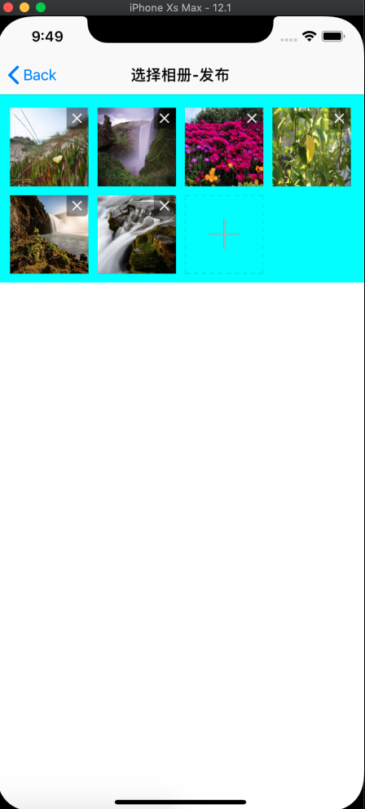
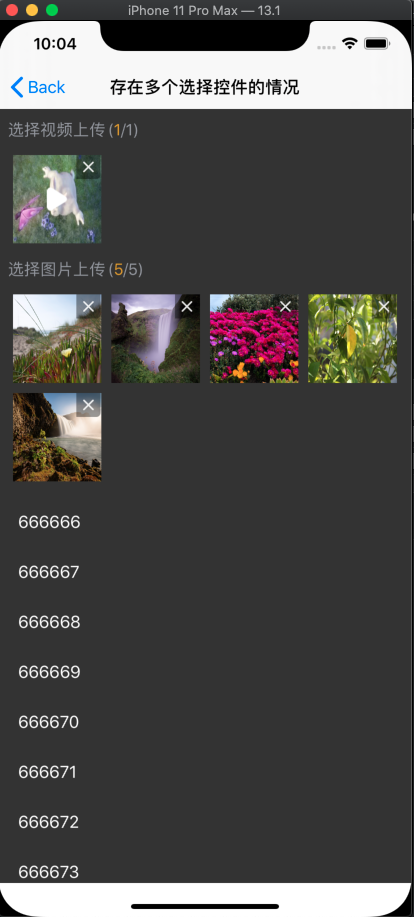

# WGBSelectPhotoView
选择图片，自适应高度，九宫格样式，发布朋友圈类型的视图
<p align='center'>

<a href="https://cocoapods.org/pods/WGBSelectPhotoView">  </a>


<a href=""></a>
<a href="http://wangguibin.github.io"></a>

</p>

## Example







## Feature List

- ✅ 支持多选  
- ✅ 支持删除
- ✅ 支持拖动排序
- ✅ 支持浏览大图 
- ✅ 支持自适应高度
- ✅ 支持选择视频

To run the example project, clone the repo, and run `pod install` from the Example directory first.

## Requirements

support iOS 8.0+

## Installation

WGBSelectPhotoView is available through [CocoaPods](https://cocoapods.org). To install
it, simply add the following line to your Podfile:

```ruby
pod 'WGBSelectPhotoView'
```

## Author

Wangguibin, 864562082@qq.com

## License

WGBWaveLayerButton is available under the MIT license. See the LICENSE file for more info.

